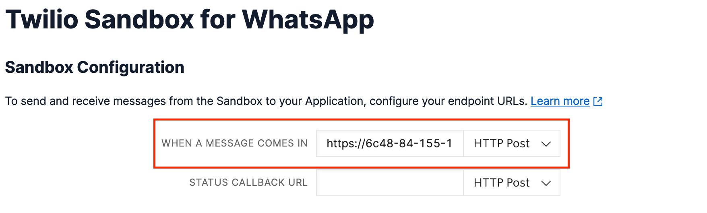

# Whatsapp Chatbot Adapter

## Prerequisits
- [Node JS](https://nodejs.org/en/)
- [NGROK](https://ngrok.com/)
- [Twilio-Account](https://www.twilio.com/)
- WhatsApp-Account


## How to start the project

1. Log into Twilio-account and follow the [Whats-App Sandbox Setup](https://www.twilio.com/docs/whatsapp/sandbox)

2. Open the project

3. Setup dependencies using `npm install` or update dependecies using `npm update`

4. Update `TWILIO_ACCOUNT_SID` in [.env](.env) with the account-SID of your [*Twilio Account*](https://console.twilio.com/?frameUrl=%2Fconsole%3Fx-target-region%3Dus1)

5. Update `TWILIO_AUTH_TOKEN` in [.env](.env) with Account-SID of your [*Twilio Account*](https://console.twilio.com/?frameUrl=%2Fconsole%3Fx-target-region%3Dus1)

6. Open terminal and start ngok-tunnel using 
`ngrok http PORT`
</br>
Make sure to use the same `PORT` as configured in the [.env](.env)-file, or to change the `PORT` in the [.env](.env)

7. Insert the `NGROK-FORWARDINGLINK/whatsapp` into your [*Twilio Sandbox Setup*](https://console.twilio.com/us1/develop/sms/settings/whatsapp-sandbox?frameUrl=%2Fconsole%2Fsms%2Fwhatsapp%2Fsandbox%3Fx-target-region%3Dus1) as the endpoint for incoming messages *___(You'll have to update the URL everytime you start a new ngrok-tunnel!)___*</br>
example link: </br>
```https://f7dd-2003-d5-af08-7e92-9d7c-1443-4bdf-5ad8.ngrok.io/whatsapp``` </br>
Twilio sandbox: </br>


8. Join your Twilio-sandbox on Whatsapp

9. Open a second terminal and start the project using `npm start``

10. Start messaging the bot!

*If you've already done the initial setup of the project once, you can skip steps 1 - 5.*